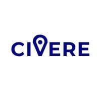

   

# CIVERE
## Projeto Inserido na Unidade Curricular Laboratórios de Informática IV 2019/2020
### [Mestrado Integrado em Engenhária Informática na Universidade do Minho](https://miei.di.uminho.pt/)

O nome **Civere** deriva de **Civita** e **Peregrinandum**, palavras em latim que significam, respetivamente cidade e excursão. De facto a Civere é nada mais, nada menos que um serviço aplicacional móvel que permite aos utilizadores explorar as variádas cidades disponíveis. Contando com um catálogo de Restaurantes, Hoteis e Monumentos, bem como um serviço freelancer de visitas turísticas, a Civere torna-se uma ferramenta de extrema necessidade para viajantes destemídos que pretendem explorar e conhecer. 

Este projeto nasce de um brainstorming para a Laboratórios de Informática IV, foi construida utilizando **C#** para criar um serviço REST de dados e [**Android Studio**](https://developer.android.com/studio), para o desenvolvimento, em **Java**, da aplicação móvel. Foram utilizados **SQL** para persistência de dados e [**Json Web Token**](https://jwt.io) para garantir segurança aos utilizadores, bem como aos serviços implementados.

* [Frontend](https://github.com/chico2911/Civere/tree/master/Civere13)
* [Backend](https://github.com/chico2911/Civere/tree/master/Server)
* [Database](https://github.com/chico2911/Civere/tree/master/Base%20de%20Dados)

## Development Team

* [Ângelo Sousa](https://github.com/AngeloACSousa)
* [Eduardo Costa](https://github.com/EduardoCosta99)
* [Francisco Lopes](https://github.com/chico2911)
* [Ricardo Carvalho](https://github.com/rvcarvalho99)
* [José Pinto](https://github.com/ZePinto99)

###[Apresentação](https://github.com/chico2911/Civere/tree/master/docs/apresentacao.pdf)

###[Relatório](https://github.com/chico2911/Civere/tree/master/docs/relatorio.pdf)

### Agradecimentos

Um especial agradecimento à [Leonor Araújo](https://www.linkedin.com/in/leonorara%C3%BAjo99/) que fez o design gráfico para a apresentação do projeto. Não esquecer toda a equipa docente que nos orientou e aconselhou. 